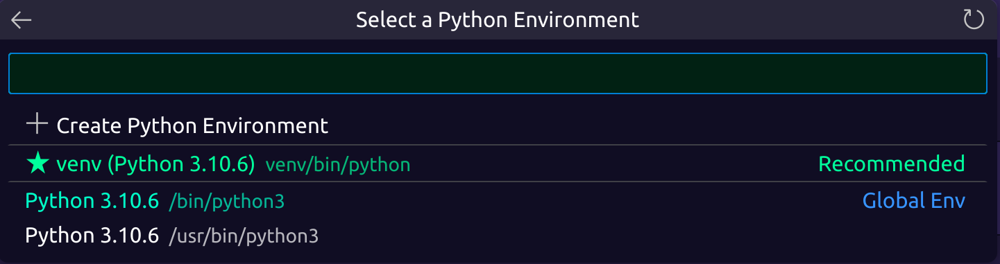

# Main Goals

###### This guide is for ubuntu but can be translated to other unix based systems

#### Assumptions

* You have python and pip (package manager) installed
* You have visual studio code installed
* You have git installed
* You have Juptyer VScode extension installed - can be found at ms-toolsai.jupyter

#### Steps

1. Create a virtual environment `python -m venv venv`
2. Activate virtual environment `source venv/bin/activate`
3. Install cadCAD

   * For the latest version of python
   * ```bash
      git clone --branch python3_10 git@github.com:kapulkin/fn.py.git
      cd fn.py/
      python setup.py install
      pip install cadCAD
     ```
4. Go back to main directory `cd ..`
5. Make a Juptyer notebook file `touch cadCAD.ipynb`
6. Open the file in vscode `code cadCAD.ipynb`
7. Click on the top right corner of the notebook and select `select kernel` 
8. Select python environments 
9. Select the virtual environment you created 
10. Test that everything works try out a the test file.
11. I forgot to download some dependencies for the test file. `pip install matplotlib`
